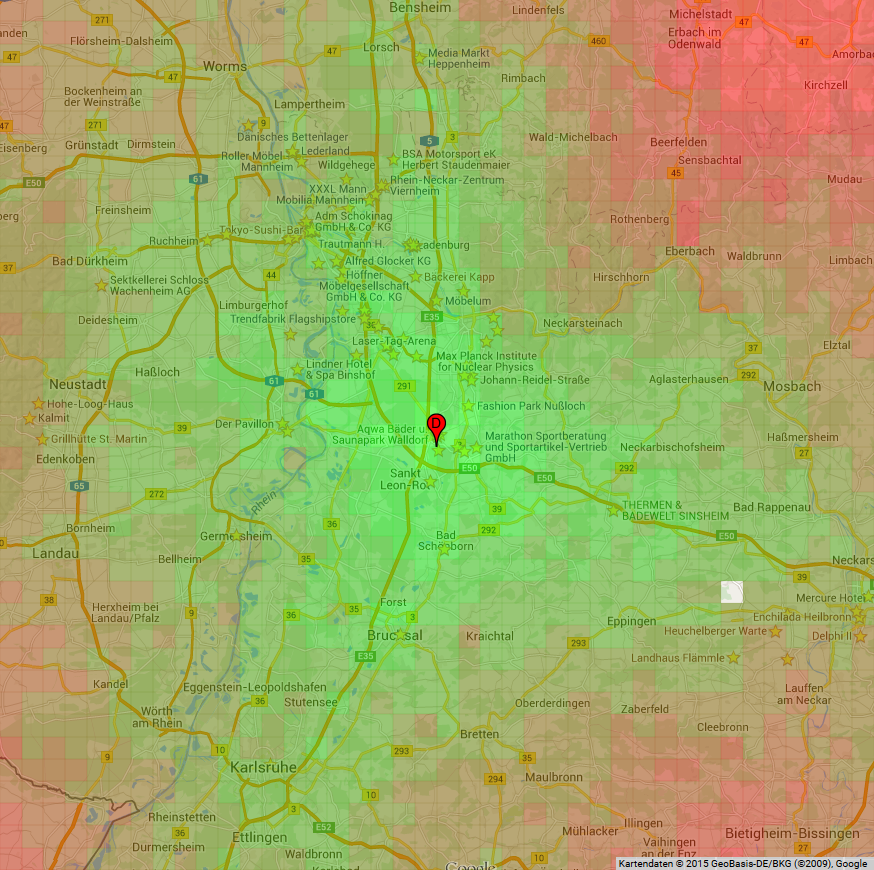
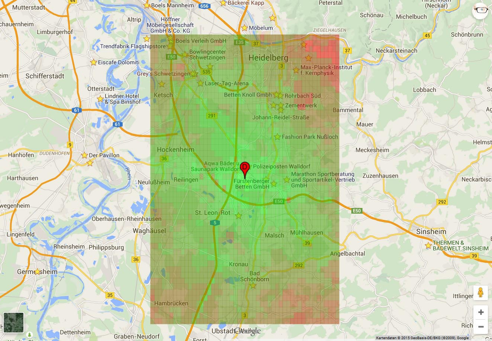

# Google Maps Duration Heat Map

This is a research project generating a *Travel Duration Heat Map* for a specific destination.

This way you can directly see for any location on the map how long it normally takes (by car) to reach the destination from there. Such a map could for example help to identify good and bad locations to move to, based on the time needed to drive to work (destination) every day.

[**Here you can test the current version**](http://rawgit.com/alexanderlink/GoogleMapsDurationHeatMap/master/DistanceHeatMap.html) (having a hard coded destination at the moment).

**Examples**

